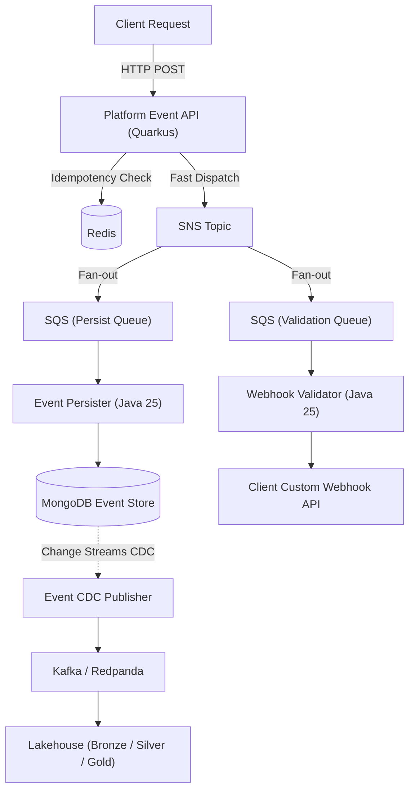

# Open Agnostic Data & Event Platform

This repository contains the architecture and implementation of an agnostic, cell-based platform merging **Deterministic Event Processing** (transactional workflows, CQRS, Webhooks) with **Probabilistic Data Analytics** (Lakehouse, CDC, Machine Learning pipelines). 

By uniting exact, real-time command routing with massive analytical pipelines, this platform demonstrates how transactional integrity and big data insights can coexist beautifully.

## Architecture Highlights

*   Cell-Based Architecture: Unified codebase with infrastructure isolated by product or client.
*   Event-Driven CQRS: Fast Dispatching via Quarkus API Gateway, deferring persistence to asynchronous workers.
*   Agnostic Core: Zero business logic in platform services. All domain rules are delegated to external Webhooks (Validator and Action Webhooks).
*   Change Data Capture: Real-time event streaming from MongoDB to Kafka for analytical ingestion and cache invalidation.
*   Lakehouse Integration: Ready for Medallion architecture (Bronze, Silver, Gold layers) using Apache Iceberg.
*   Observability: Full tracing and monitoring stack with OpenTelemetry, Prometheus, Loki, and Grafana.

## Technology Stack

*   Java 25: Used for high-throughput platform services, leveraging GraalVM and Virtual Threads.
*   Quarkus 3.37.x: Cloud-native Java framework for Gateway and Webhook integrations.
*   Go 1.22: Used for lightweight utility workers (Schema Validator).
*   Databases: MongoDB, Redis.
*   Messaging: LocalStack (SQS/SNS), Redpanda (Kafka), Apicurio Registry.

## Local Environment Setup

The entire infrastructure runs locally via Podman Kube Play, utilizing native Kubernetes manifests.

1. Ensure Podman is installed.
2. Run the platform manifests located in `infra/k8s-local`:
   `podman kube play infra/k8s-local/00-platform.yaml`
   `podman kube play infra/k8s-local/01-databases.yaml`
   `podman kube play infra/k8s-local/02-messaging.yaml`
   `podman kube play infra/k8s-local/03-observability.yaml`
   `podman kube play infra/k8s-local/04-services.yaml`
